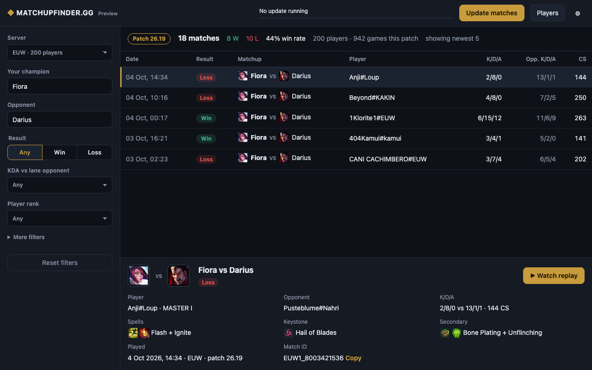
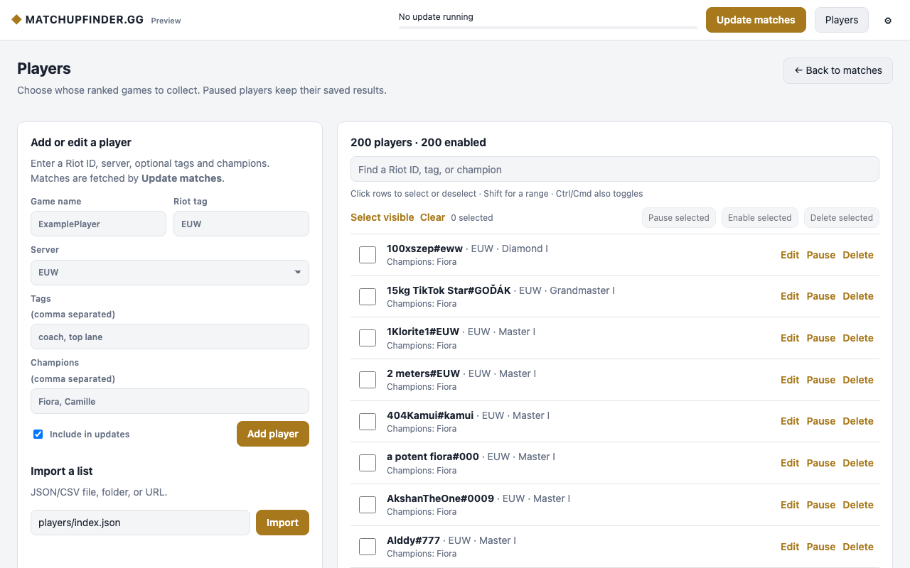

  
  <h1>MatchupFinder.gg</h1>
  
<strong>Find the matchup. Study the player. Watch the replay.</strong>

  
Search real League of Legends ranked Solo/Duo games from the players you follow.

  

    <a href="https://github.com/MrWaip/matchup-lookup/releases/download/nightly/matchup-lookup-gui.exe"><strong>Download for Windows</strong></a>
    · <a href="#quick-start">Quick start</a>
    · <a href="DEVELOPMENT.md">Setup guide</a>
  

  
  
Real Fiora vs Darius games from a local database · Dark theme

## Why MatchupFinder.gg?

| Find the right game | Learn from both sides | Get straight to the replay |
| --- | --- | --- |
| Filter by champion, lane opponent, result, KDA, rank, server and duration. | Inspect a player's spells, runes and stats; search a stored lane matchup from either side. | Open current-patch replays in the running League Client. |

## Quick start

1. [Download the Windows app](https://github.com/MrWaip/matchup-lookup/releases/download/nightly/matchup-lookup-gui.exe).
2. Add a key from the [Riot Developer Portal](https://developer.riotgames.com/) under **Settings → Riot API keys**.
3. Open **Players** and add a Riot ID (`GameName#TagLine`), or import the included Fiora list. Click **Update matches**.
4. Choose **Your champion** and **Opponent**, select a game and click **Watch replay**.

The League Client must be running on the match's server. Riot replays are available only for the current patch, which the app searches by default. The first update of a large list can take time because Riot limits API requests.

## Your player list, your way

Add players one at a time or import a JSON/CSV file, folder or URL. Use optional tags and champion labels to organize the list. Search Riot IDs, tags and champions with fuzzy matching.

Click rows or their checkboxes to select and deselect multiple players. Shift selects a range; Ctrl/Cmd also toggles a row. Apply **Pause**, **Enable** or **Delete** to the selection. Pause skips future updates while keeping saved games. Delete removes those players and their saved search results.

  
  
Real player list from a local database · Light theme

Choose **System**, **Light** or **Dark** under **Settings → Appearance**. The app remembers your choice. Champion labels in the player list are for organization; match filters use the champion actually played in each game.

## More

Prefer a terminal? Download the [Windows CLI](https://github.com/MrWaip/matchup-lookup/releases/download/nightly/matchup-lookup.exe). Need examples and troubleshooting? Read the [setup and usage guide](DEVELOPMENT.md).

MatchupFinder.gg uses Riot Games data but is not endorsed by Riot Games. League of Legends and Riot Games are trademarks of Riot Games.
